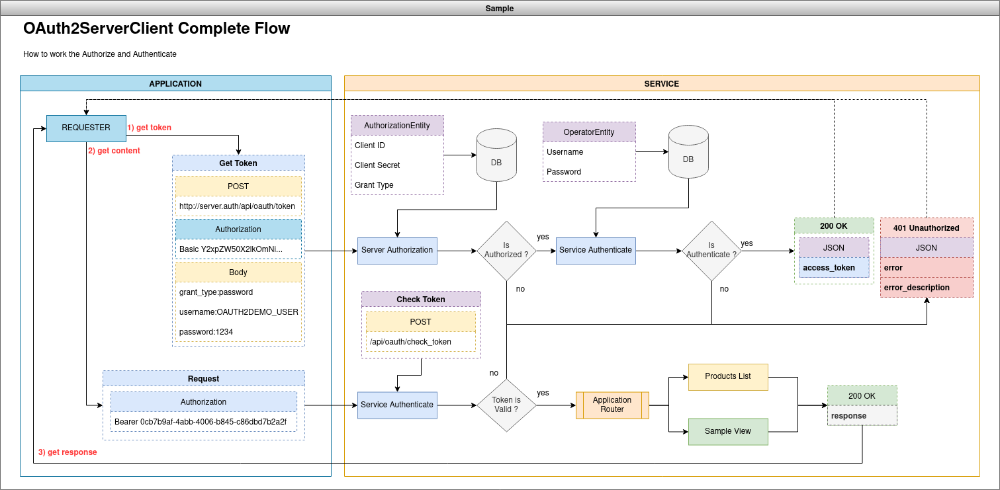
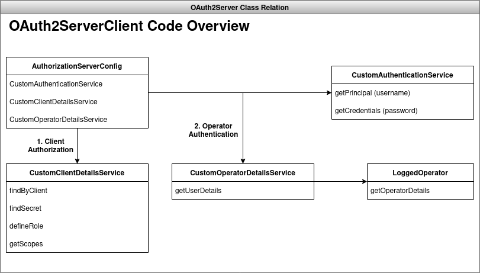
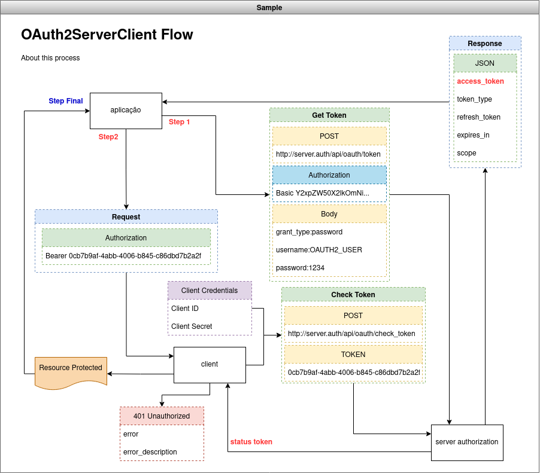
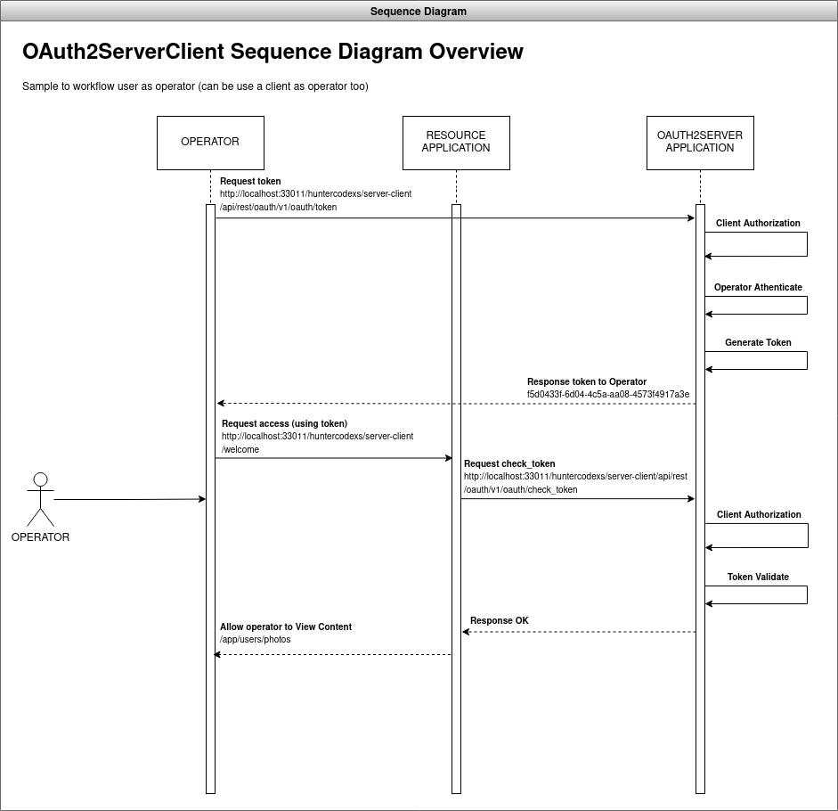
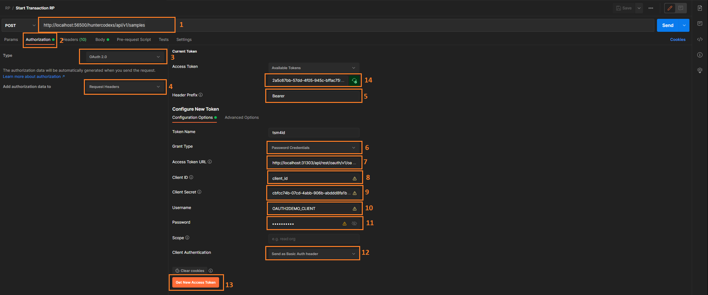

# OAUTH2 SERVER CLIENT DEMO
An complete OAuth2 Env in a unique project

# OVERVIEW

> About

This project uses the OAuth2 protocol for client authorization and also user authentication using a authorization and 
token generation server and a user authentication and token validation service.

> Diagram

- Diagram Complete Flow

- Classes Relation Overview

- Diagram Flow Resumed

- Diagram of Sequence

> How to use OAuth2 in Postman (with grant-type password)

To perform authentication and authorization via OAUTH2, follow the instructions below (as shown in the image):

1- Configure the REQUEST URL as needed, example: [GET] http://localhost:33011/huntercodexs/server-client/welcome

2- Click on the Authorization tab of the REQUEST

3- Choose as in Request Type OAuth 2.0

4- Choose in "Add authorization data to" the value Request Headers

5- In Header Prefix, enter the Bearer value

6- In Grant Type choose Password Credentials

7- In access token URL, enter the URL where the OAUTH2 service is running and managing the tokens, for example:
http://localhost:33011/huntercodexs/server-client/api/rest/oauth/v1/oauth/token

8- In Client ID, enter the id of the client that is previously registered in the system or service, for example: client_auth_id

9- In Client Secret, enter the secret that the client must use to authenticate in the API

10- In Username, enter the username, for example: OAUTH2DEMO_USER

11- In Password, enter the user's access password, for example: 1234567890

12- In Client Authentication choose "Send as Basic Auth header"

13- Click on the "Get New Access Token" button

14- Synchronize the token generated in the application environment by including the token in the Request Header
